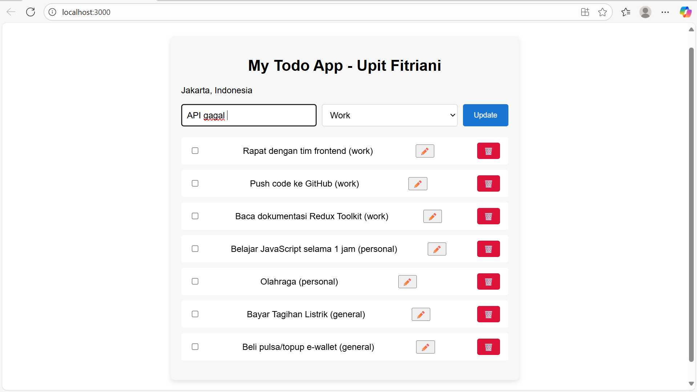
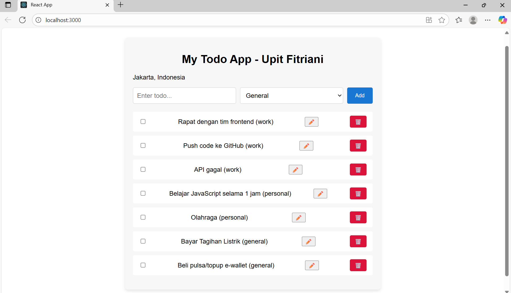
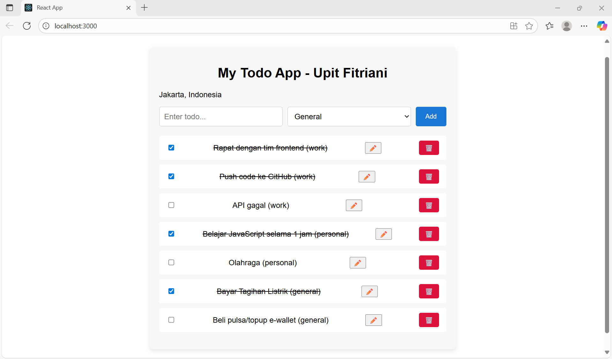
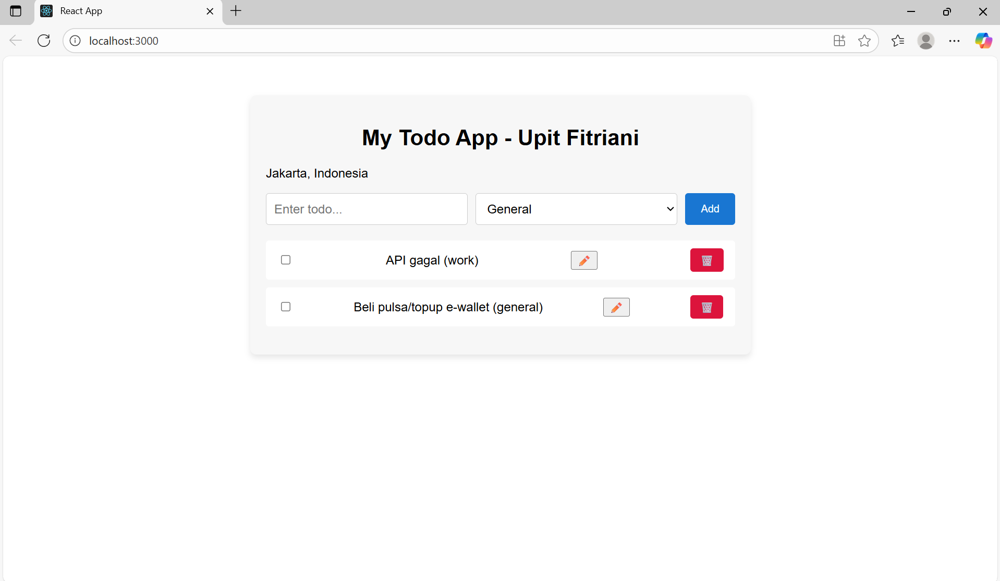

# 📝 My To-do App - Upit Fitriani

## 🌟 Features

- ✅ Add, Edit, and Delete tasks
- ✅ Mark tasks as completed
- ✅ Categorize tasks by "General", "Work", or "Personal"
- ✅ Fetch external public data (e.g., weather API)
- ✅ Save tasks offline using local storage

## 🔌 How to Run the App

1. Clone this repository:
   ```bash
   git clone https://github.com/upitfitriani/todo-app.git

## Screenshoot app




